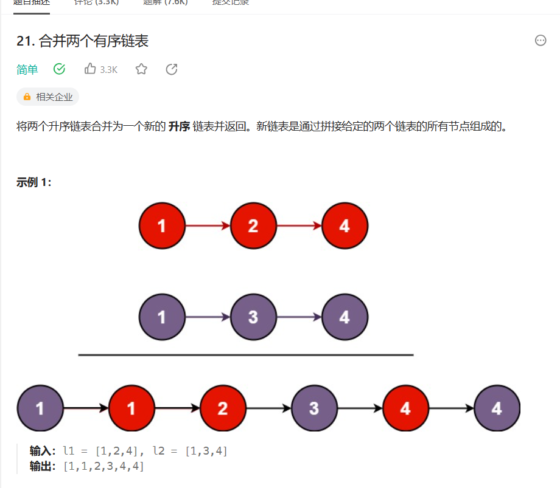
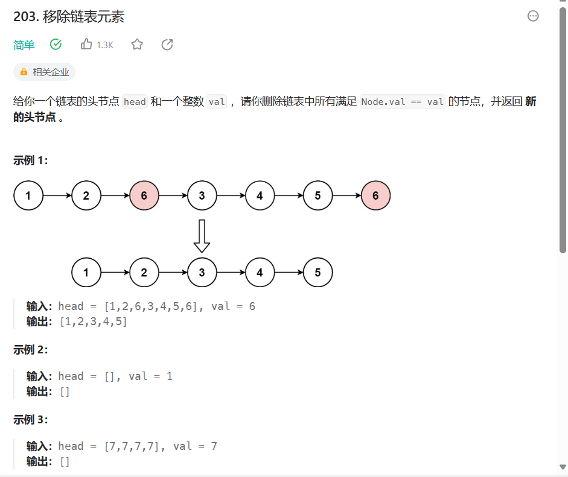

### 二分查找

```c++
int search(int* nums,int size, int target) {
        int left = 0, right = size - 1;
        while(left <= right){
            int mid = (right - left) / 2 + left;
            int num = nums[mid];
            if (num == target) {
                return mid;
            } else if (num > target) {
                right = mid - 1;
            } else {
                left = mid + 1;
            }
        }
        return -1;
    }
```


### 移除特定元素

题目：

给你一个数组 `nums` 和一个值 `val`，你需要 **[原地](https://baike.baidu.com/item/原地算法)** 移除所有数值等于 `val` 的元素，并返回移除后数组的新长度。

不要使用额外的数组空间，你必须仅使用 `O(1)` 额外空间并 **[原地 ](https://baike.baidu.com/item/原地算法)修改输入数组**。

元素的顺序可以改变。你不需要考虑数组中超出新长度后面的元素。

（my code）

```c
`int removeElement(int* nums, int numsSize, int val)
{
	int sum = 0;
	for (int i = 0; i <= numsSize - 1; i++)
	{
		if (nums[i] == val)
			sum++;
		else
			nums[i - sum] = nums[i];
	}
	return (numsSize - sum);
}`
```


**c++**：

```c++
 int removeElement(vector<int>& nums, int val) {
        int left = 0, right = nums.size();
        while (left < right) {
            if (nums[left] == val) {
                nums[left] = nums[right - 1];
                right--;
            } else {
                left++;
            }
        }
        return left;
    }
```

### 素数个数

```c
int countPrimes(int n)
{
	int flag = 0;
	int sum = 0, x = 2, i = 2;
	while (x < n)
	{
		flag = 1;
		if (x == 1) flag = 0;
		i = 2;
		while (i * i <= x)
		{
			if (x % i == 0)
			{
				flag = 0;
				break;
			}
			i++;
		}
		if (flag)
		{
			sum++;
		}
		x++;
	}
	return sum;
}
```

### 链表反转


```c
struct ListNode* reverseList(struct ListNode* head) 
{
    struct ListNode* prev = NULL;
    struct ListNode* curr = head;
    while (curr) {
        struct ListNode* next = curr->next;
        curr->next = prev;
        prev = curr;
        curr = next;
    }
    return prev;
}
```


### 合并两个有序链表



```c++
class Solution {
public:
    ListNode* mergeTwoLists(ListNode* l1, ListNode* l2) {
        ListNode* preHead = new ListNode(-1);

        ListNode* prev = preHead;
        while (l1 != nullptr && l2 != nullptr) {
            if (l1->val < l2->val) {
                prev->next = l1;
                l1 = l1->next;
            } else {
                prev->next = l2;
                l2 = l2->next;
            }
            prev = prev->next;
        }

        // 合并后 l1 和 l2 最多只有一个还未被合并完，我们直接将链表末尾指向未合并完的链表即可
        prev->next = l1 == nullptr ? l2 : l1;

        return preHead->next;
    }
};

作者：力扣官方题解
链接：https://leetcode.cn/problems/merge-two-sorted-lists/solutions/226408/he-bing-liang-ge-you-xu-lian-biao-by-leetcode-solu/
来源：力扣（LeetCode）
著作权归作者所有。商业转载请联系作者获得授权，非商业转载请注明出处。
```

### 删除链表特定元素



```c
struct ListNode* removeElements(struct ListNode* head, int val) {
    struct ListNode* dummyHead = malloc(sizeof(struct ListNode));  //哨兵
    dummyHead->next = head;
    struct ListNode* temp = dummyHead;  // 前一个节点
    while (temp->next != NULL) {
        if (temp->next->val == val) {
            temp->next = temp->next->next;
        } else {
            temp = temp->next;
        }
    }
    return dummyHead->next;
}

作者：力扣官方题解
链接：https://leetcode.cn/problems/remove-linked-list-elements/solutions/813358/yi-chu-lian-biao-yuan-su-by-leetcode-sol-654m/
来源：力扣（LeetCode）
著作权归作者所有。商业转载请联系作者获得授权，非商业转载请注明出处。
```

